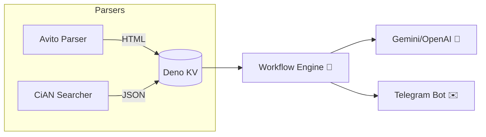

# 🏠 House Research — AI‑powered real‑estate monitor

[](https://github.com/zxcloli666/House-Research/stargazers)
[](https://github.com/zxcloli666/House-Research/network/members)
[](https://github.com/zxcloli666/House-Research/issues)
[](https://github.com/zxcloli666/House-Research/commits)
[](LICENSE)

> **House Research** — комплексная система, которая автоматически 📡 собирает объявления о недвижимости, анализирует их с помощью 🧠 ИИ и публикует красочные сводки в Telegram. Экономьте часы ручного мониторинга и получайте только действительно интересные предложения!

---

## ✨ Что умеет проект

| 🚀 Возможность                | Описание                                                                                                                  |
| ----------------------------- | ------------------------------------------------------------------------------------------------------------------------- |
| 🔄 **Мульти‑источники**       | Avito (HTML‑парсер `avito-parser` 🔗 [ветка](https://github.com/zxcloli666/House-Research/tree/avito-parser)) + Циан (неофициальный API). |
| 🤖 **ИИ‑оценка**              | Генерация рейтинга «выгодно / переплата» с учётом цены, инфраструктуры и фото.                                            |
| 🛫 **Быстрый запуск**         | Docker‑композ для продакшена и Deno‑tasks для разработки.                                                                 |
| 🚏 **Транспорт + провайдеры** | Поиск ближайших остановок и доступных интернет‑операторов.                                                                |
| 🖼️ **Коллаж изображений**    | Склейка фото объявления в единый предварительный коллаж.                                                                  |
| 📬 **Отправка в Telegram**    | Фото‑альбом ➕ HTML‑сообщение, распределение по темам чата.                                                                |
| 🐳 **Docker Ready**           | Готовые контейнеры (`ghcr.io`) для деплоя на сервере или VPS.                                                             |

---

## 🗺️ Архитектура



---

## 🔍 Как это работает

### Avito Parser

* Отдельная ветка [`avito-parser`](https://github.com/zxcloli666/House-Research/tree/avito-parser) содержит самодостаточный скрипт на Deno.
* Раз в час 🕐 (через `Deno.cron`) он обходит результаты поиска Avito и сохраняет каждый лот в `export/*.html`.
* HTML затем читается основным движком для извлечения характеристик и тенденций рынка.

### Циан Searcher

* Для доступа к полноценному поиску Циан требуется **профиль агента**. Залогиньтесь, перейдите в поиск и скопируйте все cookie запросов к циану — поместите значение в `CIAN_SEARCH_COOKIE`.
* Парсер берёт фильтр из `.yaml`‑конфигов, добавляет cookie и получает JSON со всеми объявлениями.

### AI-провайдеры и поддержка нескольких API‑ключей

```env
AI_ENDPOINT=https://openrouter.ai/api/v1
AI_API_KEY=key_one,key_two,key_three
AI_MODELS=deepseek/deepseek-r1:free,deepseek/deepseek-r1-0528:free
GEMINI_API_KEY=gk1,gk2
```

Текстовый чат ходит в любой OpenAI-совместимый endpoint (OpenRouter,
Together, Groq, DeepInfra, свой vLLM/Ollama и т.д.) через три переменные:
`AI_ENDPOINT`, `AI_API_KEY`, `AI_MODELS`. Gemini настроен отдельно —
помимо чата он нужен для мультимодальных задач (PDF/фото объявления,
Google Search grounding), которые обычный OpenAI-эндпоинт не умеет.

При достижении дневного лимита ⚡️ библиотека автоматически переключится на следующий токен.

---

## 🚀 Быстрый старт (Docker Compose)

> Минимальный пример поднимает два контейнера: основной обработчик + Avito Parser.

```yaml
version: "3.9"
services:
  house-research:
    image: ghcr.io/zxcloli666/house-research:latest
    container_name: house-research
    restart: always
    volumes:
      - ./kv:/app/kv           # Deno KV (SQLite)
      - ./conf:/app/conf       # конфигурация YAML
      - ./avito-export:/avito-export # HTML объявлений
    env_file:
      - .env

  avito-parser:
    image: ghcr.io/zxcloli666/avito-parser:latest
    container_name: avito-parser
    restart: always
    volumes:
      - ./avito-export:/app/export
    environment:
      AVITO_URL: "https://www.avito.ru/..."  # ваш фильтр
```

```bash
$ docker compose up -d
```

## 📁 Конфигурация: `.env` vs `conf/conf.yml`

В проекте два независимых файла конфигурации — их легко перепутать:

| Файл            | За что отвечает                                                                                                          | Откуда взять пример |
| ---------------- | -------------------------------------------------------------------------------------------------------------------------- | -------------------- |
| `.env`           | Секреты: токены Telegram, ключи AI‑провайдеров, RapidAPI, cookie Циан.                                                     | `.env.example`       |
| `conf/conf.yml`  | Поведение приложения: точки для расчёта маршрутов, фильтр цены/районов Циан, путь к папке с HTML Avito, уровень логов.     | `conf.example.yml`   |

Быстрый старт:

```bash
cp .env.example .env                # заполните токены/ключи
mkdir -p conf
cp conf.example.yml conf/conf.yml   # поправьте под себя (адреса, цены, районы)
```

Если `conf/conf.yml` не создать заранее — приложение сгенерирует его само со
значениями по умолчанию при первом запуске (см. `src/core/config.ts`), но эти
значения почти наверняка не подходят под вашу задачу (свои адреса, свой
бюджет, свои районы Циан) — лучше сразу настроить файл руками по примеру из
`conf.example.yml`.

⚠️ В Docker Compose обязательно смонтируйте `./conf:/app/conf`, иначе
приложение не увидит ваш `conf.yml` (это уже сделано в примере выше).

---

> **Подсказка:** создайте `.env` на основе `.env.example` и заполните токены Telegram, AI_ENDPOINT/AI_API_KEY/AI_MODELS, Gemini, RapidAPI и cookie Циан‑агента.

---

## 🧑‍💻 Локальная разработка

```bash
# Клонируем репозиторий
$ git clone https://github.com/zxcloli666/House-Research.git
$ cd House-Research

# Установка зависимостей (JSR + Deno)
$ deno task install

# Dev‑режим с горячей перезагрузкой
$ deno task dev --unstable
```

Для отдельного Avito Parser:

```bash
$ git checkout avito-parser
$ deno run -A src/main.ts
```

---

## ⚙️ Переменные окружения (основное)

| Переменная           | Обязательно | Описание                                    |
| -------------------- | ----------- | ------------------------------------------- |
| `BOT_TOKEN`          | ✅           | Токен Telegram‑бота.                        |
| `TELEGRAM_CHAT_ID`   | ✅           | ID чата/канала для публикации.              |
| `AVITO_URL`          | ✅           | URL поиска Avito (с параметрами фильтра).   |
| `CIAN_SEARCH_COOKIE` | ✅           | Cookie авторизованного профиля агента Циан. |
| `AI_ENDPOINT`        | ✅           | Любой OpenAI-совместимый endpoint (OpenRouter/Together/Groq/свой). |
| `AI_API_KEY`         | ✅           | Один или несколько токенов через запятую.   |
| `AI_MODELS`          | ✅           | Одна или несколько моделей через запятую.   |
| `GEMINI_API_KEY`     | ✅           | Отдельно для мультимодалки, поддержка нескольких ключей. |
| `GEMINI_RPM`         | ❌           | Лимит запросов к Gemini в минуту на ключ, дефолт 8. Смотрите свои реальные RPM в Google AI Studio → Rate Limits. |

> Полный список — в `.env.example`.

Модели Gemini не настраиваются через `.env` — в `src/ai-agents/gemini.ts`
зашит список конкретных моделей, отсортированный по реальным бесплатным
лимитам (Google AI Studio → Rate Limits): сначала `gemini-3.5-flash-lite`
и `gemini-3.1-flash-lite` (RPD 500), затем модели с RPD 20
(`gemini-2.5-flash-lite`, `gemini-3.6-flash`, `gemini-3.5-flash`,
`gemini-2.5-flash`). Pro-модели и `gemini-2.0-flash*` намеренно не
включены — на free tier у них 0 запросов в день, включать их в перебор
бессмысленно. Каждый запрос пробует лучшую модель на всех ваших ключах,
при неудаче — следующую по списку. Если Google поменяет лимиты/модели —
поправьте список прямо в `src/ai-agents/gemini.ts` под свежий дэшборд.


---

Откуда что брать

```
RAPID_API_KEY
https://wikiroutes.info/en/developers

CIAN_SEARCH_COOKIE
циан  в режиме контрагента


```

тулза полезная, но для запуска в ней надо разобраться.
возможно внести какие-то правки, т.к она устарела на год.

---

## 🤝 Как внести вклад

1. Откройте **issue** 📌 с описанием бага или улучшения.
2. Сделайте **fork** → `feature/my‑awesome‑feature`.
3. Отправьте **PR** с чётким описанием.
4. Получите 👍 ревью и 🚀 merge!

---

## 📝 Лицензия

Проект распространяется под лицензией **MIT** — используйте свободно и не забудьте поставить ⭐!

---

<p align="center">
  
</p>
<p align="center"></p>
